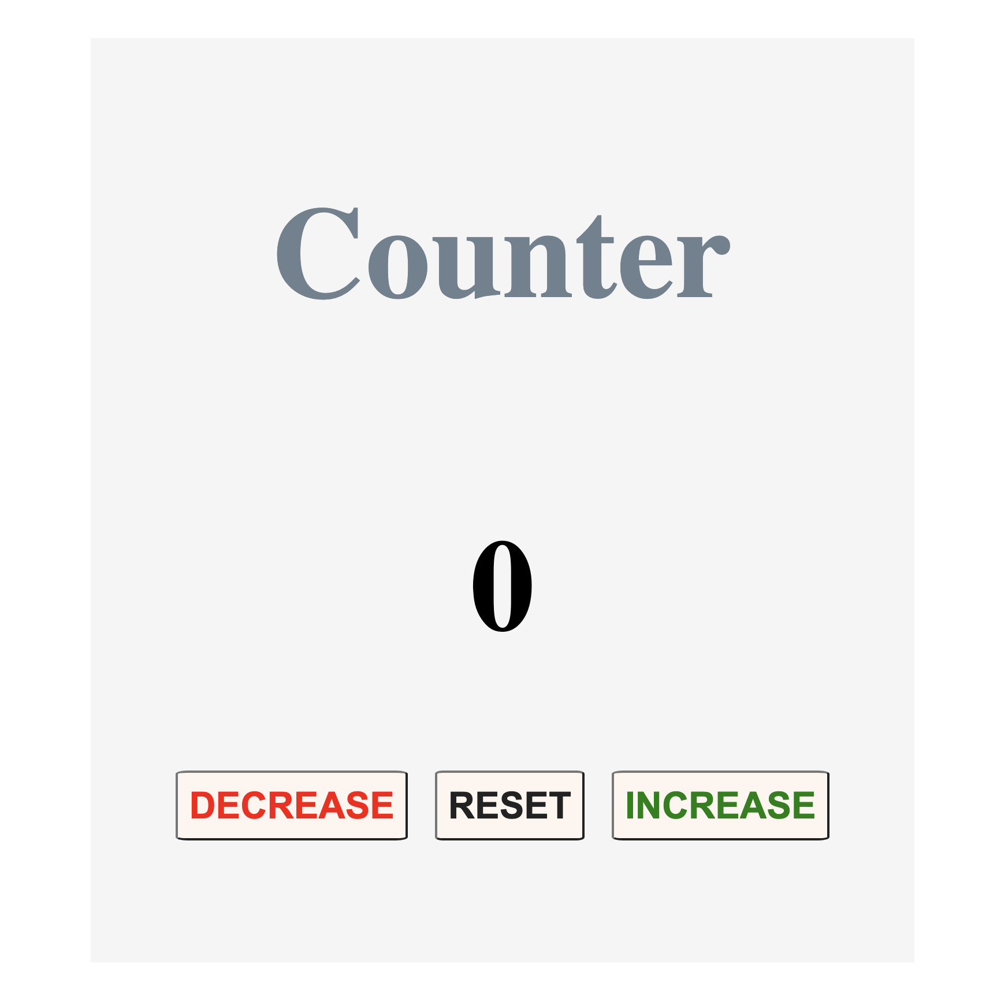
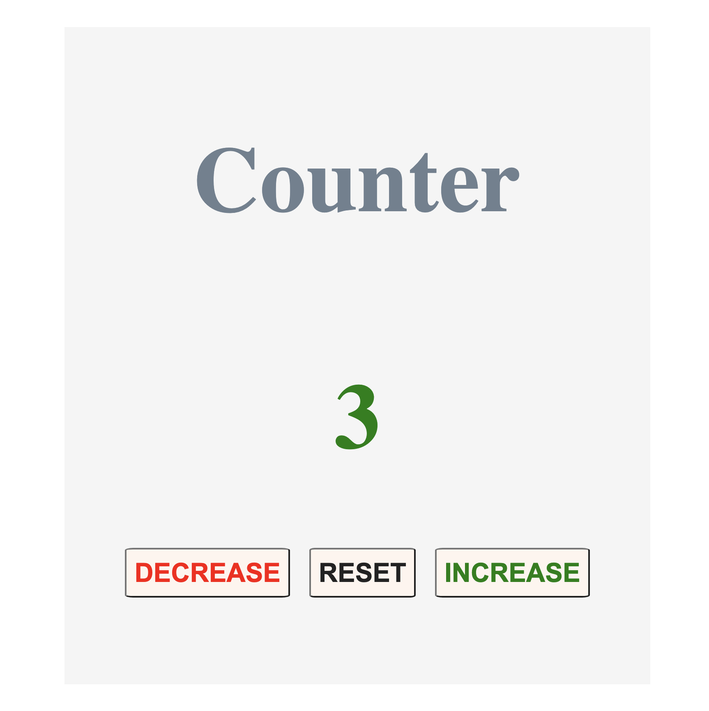
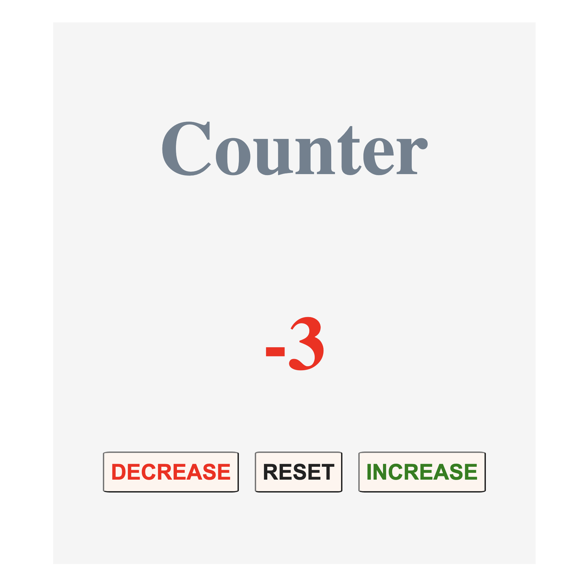

# Counter App

## Description

A very simple counter app created using HTML, CSS and JavaScript

## How to use the App

The Counter is initialised at 0.

To increment the counter press the 'INCREASE' button, to decrease press the 'DECREASE' button and to reset to 0 press the 'RESET' button.

When the value of the counter is greater than 0, it is displayed in green.

When the value is less than 0 it is displayed in red.

